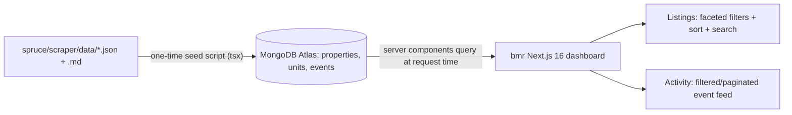

# BMR Dashboard Frontend

Build the read-only dashboard in [bmr](/Users/msaifee/Desktop/Cursor/bmr) on top of MongoDB, following the schema already defined in [docs/DATA_MODEL.md](/Users/msaifee/Desktop/Cursor/bmr/docs/DATA_MODEL.md). Seed Mongo from the existing spruce files; the Python->Mongo writer is a separate later task.

## Data flow

## Key environment / Next.js 16 facts (already verified)
- `MONGODB_URI` is present in [.env](/Users/msaifee/Desktop/Cursor/bmr/.env) (Atlas `Cluster0`); `.env*` is gitignored and untracked. Add `MONGODB_DB=bmr`.
- Tailwind v4 is already wired (`@import "tailwindcss"` in [app/globals.css](/Users/msaifee/Desktop/Cursor/bmr/app/globals.css)).
- DB reads in server components run fresh at request time (no `use cache`) - correct for a live dashboard.
- `searchParams`/`params` are async and must be awaited.

## 1. Scaffold and dependencies
- Add deps: `mongodb`, `@tanstack/react-table`, `date-fns`, `next-themes`; dev: `tsx`.
- Init shadcn (Tailwind v4 mode): `npx shadcn@latest init`, then add components: `button input select popover calendar badge table card tabs slider checkbox dropdown-menu separator sheet skeleton command`.
- This creates `components.json`, `lib/utils.ts`, updates `app/globals.css` with theme tokens.

## 2. Data layer (`lib/`)
- `lib/types.ts` - `Property`, `Unit`, `ListingEvent`, `EventType`, `UnitStatus` per the data model doc.
- `lib/mongodb.ts` - singleton `MongoClient` cached on `globalThis` (avoids connection storms in dev/serverless); exports `getDb()`.
- `lib/queries.ts` (`import "server-only"`) - `getProperties()`, `getUnits()` (all active+removed, small set), `getEvents({ propertyKey, eventType, from, to, limit, skip })`. Serialize `_id`/dates to strings.
- `lib/format.ts` - display helpers (price, date, plan badges, deal styling).

## 3. Seed script (`scripts/seed.ts`, run via `tsx`)
- Reads sibling spruce data from `SPRUCE_DATA_DIR` (default `../spruce/scraper/data`).
- Upserts `properties` from hardcoded metadata mirroring [spruce/scraper/config.py](/Users/msaifee/Desktop/Cursor/spruce/scraper/config.py) (`spruce`, `kensington-place`; city Sunnyvale, state CA).
- Parses each `listings_state.json` -> normalized `units` (parse `"570 sq. ft."`->`570`, `"Floor 1"`->`1`, `"$3517/12mo"`->`rent 3517`+`leaseTermMonths 12`, `"Jul 01, 2026"`->`Date`; derive `isBmr`/`isDeal`; `status:"active"`).
- Parses each `listings_history.md` table rows -> `events` (emoji->`eventType`, Details col->`changes`, Date col `"Jul 08, 2026 14:27 PT"`->`detectedAt`; strips `**\`...\`**` deal markup).
- Creates all indexes from the data model doc. Add `"seed": "tsx scripts/seed.ts"` to package.json.

## 4. Listings dashboard (`/`)
- `app/page.tsx` (server): `getProperties()` + `getUnits()`, pass to client table.
- `components/listings/listings-table.tsx` (client, TanStack + shadcn data-table): sortable columns (unit, plan, beds/baths, sqft, floor, rent, available, status); instant in-memory filtering since the active set is small.
- `components/listings/filter-bar.tsx` (client): property switcher, plan/building/beds/baths faceted multiselects, rent + sqft range sliders, availability date-range, "deals only" + "include removed" toggles, global text search, reset.
- Filter fields map exactly to the data-model "Filterable fields" table.

## 5. Activity timeline (`/activity`)
- `app/activity/page.tsx` (server): `await searchParams`, call `getEvents(...)` with server-side filters + pagination (events grow unbounded).
- `components/activity/activity-feed.tsx`: events grouped by day, colored by type (added/price/date/removed), showing from->to deltas and summary.
- `components/activity/activity-filters.tsx` (client): property, event-type, date-range; pushes to URL searchParams. Pagination via "Load more" (skip/limit).

## 6. App shell and polish
- `components/site-header.tsx`: title, tab nav (Listings / Activity), theme toggle.
- Update [app/layout.tsx](/Users/msaifee/Desktop/Cursor/bmr/app/layout.tsx) metadata + wrap in `next-themes` provider; replace boilerplate [app/page.tsx](/Users/msaifee/Desktop/Cursor/bmr/app/page.tsx).
- `app/loading.tsx` skeletons; empty states; responsive (filters in a `sheet` on mobile).

## 7. Verify
- `npm run seed`, `npm run dev` (sanity check data renders), `npm run lint`, `npm run build`.
- Note for deploy: set `MONGODB_URI`/`MONGODB_DB` in Vercel and allow Atlas network access.

## Out of scope (follow-ups)
- Python->Mongo writer in spruce (replaces the one-time seed for ongoing updates).
- Per-unit price/date history drill-down and charts.