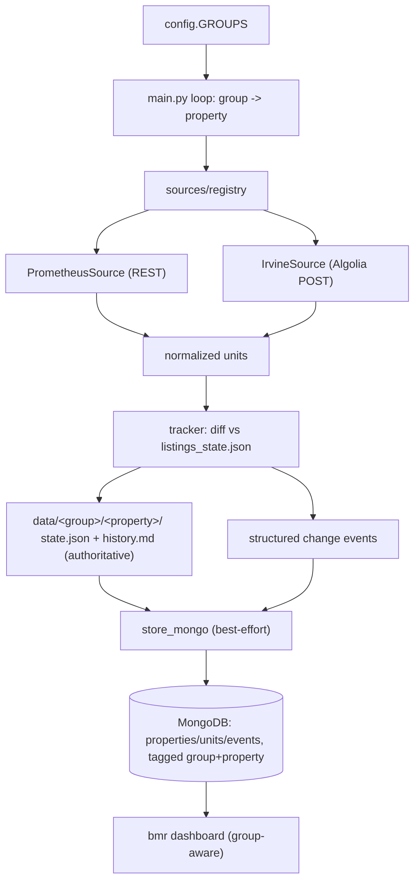

# Dual-record, multi-group scraper + group-aware dashboard

Two stores kept in sync per run, organized by group -> property. Files remain authoritative for change detection; MongoDB is a best-effort mirror (a failure logs + emails but never aborts the run or blocks the file write). Ships Prometheus (refactor) and Irvine North Park (new Algolia adapter).

## Architecture

## Part A - Scraper (`spruce/scraper/`)

### 1. Groups + adapters config
Replace flat `PROPERTIES` in [config.py](/Users/msaifee/Desktop/Cursor/spruce/scraper/config.py) with `GROUPS` (each has `key`, `name`, `adapter`, `properties[]`; property carries adapter-specific ids like `property_id` for Prometheus, `community_id_aem` for Irvine). Path helpers become group-scoped: `data/<group>/<property>/listings_state.json|listings_history.md`. `git mv` existing `data/spruce` and `data/kensington-place` under `data/prometheus/`.

### 2. Adapter framework
New `scraper/sources/` package:
- `base.py` - `Source` ABC: `fetch(property) -> list[raw]`, `parse(raw) -> dict[unit_id -> normalized]`. Normalized dict keeps today's shape (`plan/sqft/floor/available/price/bedrooms/bathrooms`) plus optional `section` and `bmr_type`.
- `prometheus.py` - wraps existing [fetcher.py](/Users/msaifee/Desktop/Cursor/spruce/scraper/fetcher.py) + [parser.py](/Users/msaifee/Desktop/Cursor/spruce/scraper/parser.py) (SSL fallback, `parse_listings`).
- `irvine.py` - Algolia `POST https://JV59LDJGMN-dsn.algolia.net/1/indexes/*/queries` filtered by `communityIDAEM` (per [docs/irvine-north-park-api.md](/Users/msaifee/Desktop/Cursor/spruce/docs/irvine-north-park-api.md)); maps each hit: `unitId=objectID`, `section=propertyName` (sub-community), `unitNumber=unitMarketingName`, `plan=f"{unitTypeName} BMR ({bmrType})"`, price from `unitStartingPrice`, `available` via a new `YYYYMMDD` parser, beds/baths from `floorplanBed/Bath`.
- `registry.py` - `adapter key -> Source`.

### 3. Shared classification
Move deal/BMR flags (`is_bmr`, `is_income_limited`, `is_deal`) onto normalized units (shared helper; Irvine units are inherently BMR via plan text). Generalize the BMR email alert in [main.py](/Users/msaifee/Desktop/Cursor/spruce/scraper/main.py)/[notifier.py](/Users/msaifee/Desktop/Cursor/spruce/scraper/notifier.py) to use these flags instead of the Prometheus-only `find_bmr_plans`.

### 4. Structured events from the diff
Extend `update_history` in [tracker.py](/Users/msaifee/Desktop/Cursor/spruce/scraper/tracker.py) to also return structured events (`unit_id`, `event_type`, `changes{price,available}`, `snapshot`, `detected_at`) alongside the markdown/state it already writes. Single diff pass; files stay the basis.

### 5. MongoDB mirror (best-effort)
New `scraper/store_mongo.py` using `pymongo`: upsert property (`group`,`groupKey`), upsert current units (with `section`,`bmrType`,`status`), flip missing to `removed`, insert this run's events. Wrapped so missing `MONGODB_URI`/`pymongo` or any error is a non-fatal no-op returning an error string. Add `pymongo` to [requirements.txt](/Users/msaifee/Desktop/Cursor/spruce/scraper/requirements.txt); add `send_store_error_alert(...)` and put `<group>` in `history_url`.

### 6. Orchestration + workflow
[main.py](/Users/msaifee/Desktop/Cursor/spruce/scraper/main.py) loops `GROUPS -> adapter -> properties`; after file write calls `store_mongo.sync_property(...)`, emailing on Mongo error and continuing. Update [check-listings.yml](/Users/msaifee/Desktop/Cursor/spruce/.github/workflows/check-listings.yml) to `pip install -r scraper/requirements.txt` and inject `MONGODB_URI` secret (you add the secret + open Atlas network access).

## Part B - bmr dashboard

### 7. Schema
Update [docs/DATA_MODEL.md](/Users/msaifee/Desktop/Cursor/bmr/docs/DATA_MODEL.md): add `group`/`groupKey` (properties/units/events), optional `section` and `bmrType` (units/events snapshot), unique key becomes `(groupKey, propertyKey, unitId)`. Mirror in [lib/types.ts](/Users/msaifee/Desktop/Cursor/bmr/lib/types.ts) and map through in [lib/queries.ts](/Users/msaifee/Desktop/Cursor/bmr/lib/queries.ts).

### 8. UI
- Add a Group filter; property switcher becomes group-aware (Group -> Property).
- Replace the "Building" facet with a "Section" facet using `section` (fallback to `buildingNumber`).
- Extend `unitLabel` in [lib/format.ts](/Users/msaifee/Desktop/Cursor/bmr/lib/format.ts) so Irvine units (objectID keys) render as `section - unitNumber` (e.g. "The Oaks - 1150").
- Activity page + filters gain the group dimension.

### 9. Seed = recovery tool
Update [scripts/seed.ts](/Users/msaifee/Desktop/Cursor/bmr/scripts/seed.ts) to walk `data/<group>/<property>/...` and write group fields from a small groups manifest (mirrors scraper config). It stays format-agnostic (reads normalized files), so it remains the "rebuild Mongo from files" path. Remove the stray [bmr/temp](/Users/msaifee/Desktop/Cursor/bmr/temp) research HTML.

## Verification
- Run `python scraper/check.py` with `MONGODB_URI` set: confirm `data/prometheus/*` and `data/irvine/north-park/*` files written and Mongo updated for both groups; then run with a bad URI to confirm the run still succeeds (files written, store-error alert path hit).
- Sanity-check the live Irvine Algolia call returns North Park BMR hits.
- bmr: `npm run seed`, `npm run build`, `npm run lint`, verify both groups render and filters work.

## Decisions carried in
- Files are the diff basis; Mongo mirrors (resilient to Mongo downtime).
- Best-effort dual-write, non-fatal + emailed on failure.
- Nested files `data/<group>/<property>/`; single Mongo DB with group fields.
- North Park = one property; sub-community = `section`. Kensington `None-<unit>` keys left as-is (display-only fix already handles it).
- Irvine search-only Algolia key is public/embedded; hardcode with a re-scrape note if it 403s.